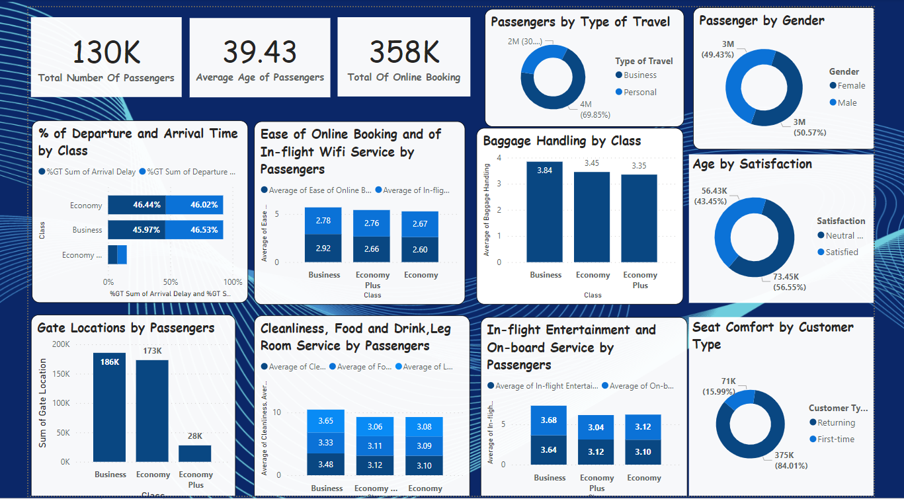

# Dano-Airlines-Analysis

## Introduction
This Power BI Project is aimed at analysing and drawing out meaningful insights from a Uk-based airline
headquartered in London, United Kingdom called **Dano Airlines** Which will lead to data driven solutions.

**_Disclaimer**_; _All data sets report Do not represent any company, intuition, or country but just a practice data set to demonstrate the capabilities of Power BI._

## Skills/Concept Demostrated
The following measures where incoperated ; DAX new measures; count,sum, average.

## Data Sourcing
the data set is gotten from Digitaley_drive and is downloaded as an excel file then extracted into Power Bi for cleaning, analysis and visualization

## Problem Statement
analyze the data and find the key areas to focus on for getting
back on track with Customer satisfaction scores from 120,000+ airline passengers, including additional information about
each passenger, their flight, and type of travel, as well as their evaluation of different factors like
cleanliness, comfort, service, and overall experience.

## Modelling
the model is a single table schema, the data set consist of one table that contains all necessary informations about the passengers and their flight, and type of travel, as well as their evaluation of different factors like
cleanliness, comfort, service, and overall experience.

## Visualization

The dashboard contains the following
1.passengers demographics
2.satisfaction levels
3.type of travel 
4.category analysis

## Analysis
1.the average age of passemgers is 39.
the data set from dano airlines shows that the total number of passengers is 130k
the percentage of female passengers is 50.57% and the percentage of male passengers is 49.43%. Both genders showed a neutral?dissatisfied or satisfied level in the dashboard.

2.43.45% Were satisfied while 73.45% Were neutral/dissatisfied with their flights.

3.69.85% were travelling for business purposes while 30.15% were travelling for personal reasons, majority of such passengers were returning passengers with a percentage of 84.01% and 15.99% are first timers this is consisistent by the comfort of their seats

4.the dashboard further explains different evaluation of the Depature and arrival time,ease of online booking, gate location, inflight entertainment, food and drink,cleanliness, leg room service, check in service etc that the airline is predominantly focused in the business and ecomomy class's as opposed to the economy plus where services are less rendered.

## Conclusion/Reccommendation
1.Focus on strenghtening the economy class by improving in flight services, comfort etc which will in turn improve customers satisfaction.

2.continous monitoring and regulating customers feedback

3.Enhance online check in services and make it more user friendly

4.passengers travelling for business could miss their business meetings due to delays so its advisable to reduce the number of delays to enhance customers satisfaction

#THANK YOU...

